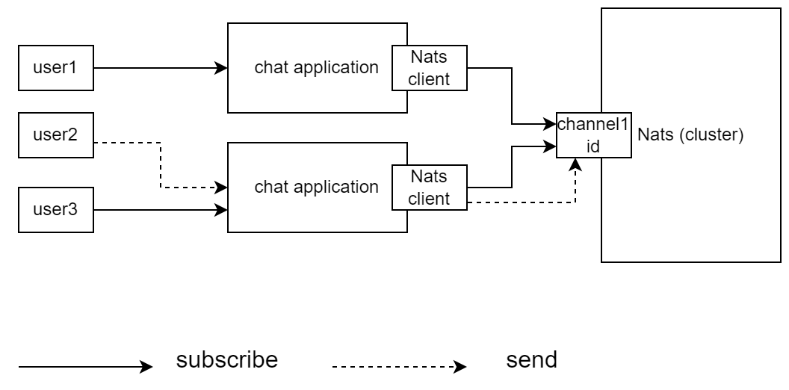
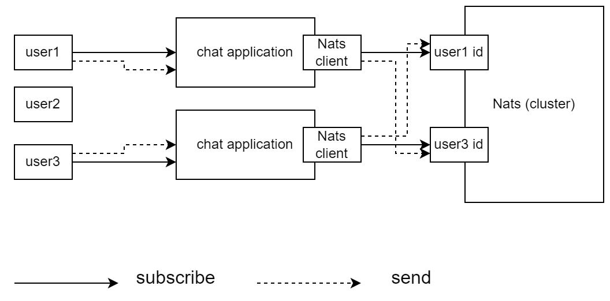
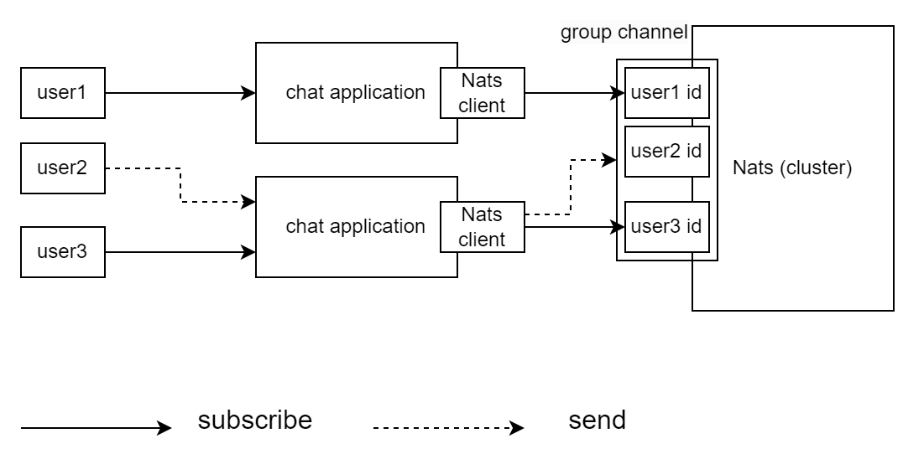

# Technical details of the chat

## Chat in public channel

- A public channel allows any user to chat online.
- Each subscription target is channel id.
- Query history messages by channel id.

## Chat in private channel

- Every two users can chat with each other in a private channel.
- Each subscription target is user id.
- Query history messages by user id 

## Chat in group channel (Work in progress...)

- A group channel allows any members to chat online. A user should 
be invited to the channel first by any member, and the user should 
accept the invitation to become a member. 
- Each subscription target is user id.
- Query history messages by channel id.

